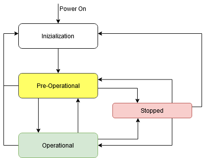

# CANopen State

A CANopen network consists of a NMT master (network management) and NMT slaves. In this case, the NMT master controls all devices and can change their communication states. A CANopen device is in one of four possible states:

Initialization: After switching on, the node passes through this state. At this time, the device application and the device communication (bit rate and node address) are initialized. Afterwards, the node switches independently to the "Pre-Operational" state.

Pre-Operational: Communication with the node is possible via SDOs. However, the node is not able to perform PDO communication.

Operational: The CANopen node is fully operational. It can independently send and receive process data.

Stopped: The node is completely separated from the network. No SDO or PDO communication is possible. The node can changed to another network state only by a corresponding network command (example: start node).

9.0

© Copyright 2025, CODESYS GmbH