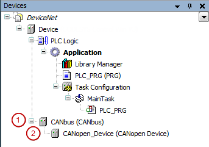

# General

In CODESYS, a CANopen Local Device is a slave device that you insert in the device tree of a project directly below a CAN bus node. As a result, the CODESYS runtime acts as a CANopen Slave.

(1) CANbus node

(2) CANopen Local Device

9.0

© Copyright 2025, CODESYS GmbH