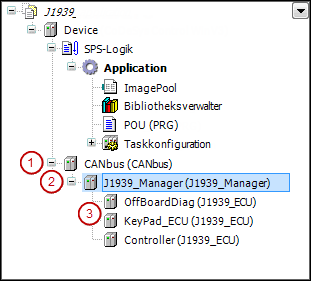

# General

The J1939 Manager is inserted in the device tree below the CAN bus node. It provides the J1939 parameter groups and signal database.

The ECUs are inserted below the J1939 Manager.

The **Scan Devices** command is not available for J1939.



```
(1) CANopen Manager    (2): J1939-Manager    (3) J1939-ECU
```

9.0

© Copyright 2025, CODESYS GmbH