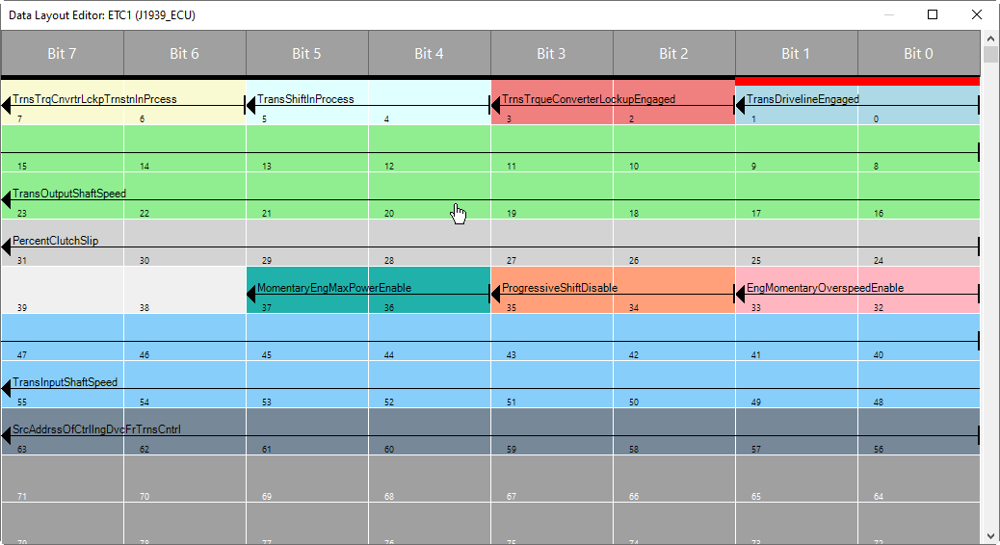

# Dialog: Data Layout Editor

Graphical representation of the data layout of a parameter group

* The position of the data area is displayed graphically in a different color for each signal.
* Overlapping areas are shaded to make them easier to recognize.
* The graphical representation should help you to get an overview of the layout of the data.

You can move the start and end of the data range to change the length of the signal or the signal position within the parameter group.

Because the editor is not modal, you can change the signal configuration ([Tab: J1939-ECU – TX Signals](_can_edt_j1939_ecu_txsignals.html#_can_edt_j1939_ecu_txsignals)) without closing the editor.

To analyze and interpret the data contents of a CAN message, you can also open the editor as read-only in online mode.

TIP:

Leave the data layout editor open while you make changes to the signal configuration. The changes are immediately applied and displayed.

Graphical symbols in the editor

|  |  |
| --- | --- |
| Arrow | When you point the cursor at the arrow, the display of the cursor changes and you can move the end of the data range. |
| Bar | When you point the cursor at the bar, the display of the cursor changes and you can move the start of the data range. |

**Example**

9.0

© Copyright 2025, CODESYS GmbH