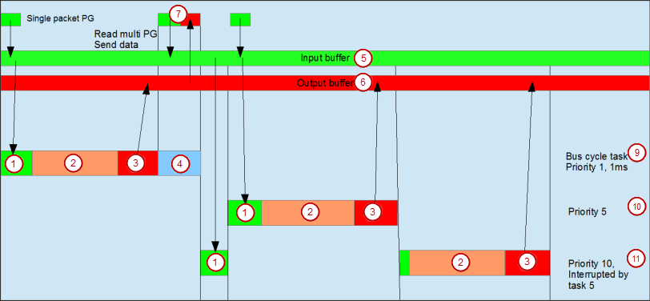

# Bus Cycle Task

(1) Receiving Single Package PG

(2) IEC task

(3) Writing outputs to output buffer

(4) Receiving multipackage PGs, sending PGs

For more information, see: [task configuration](../../../../../../api/crossBook?lang=en-US&virtualBookName=../&topicID=)

9.0

© Copyright 2025, CODESYS GmbH