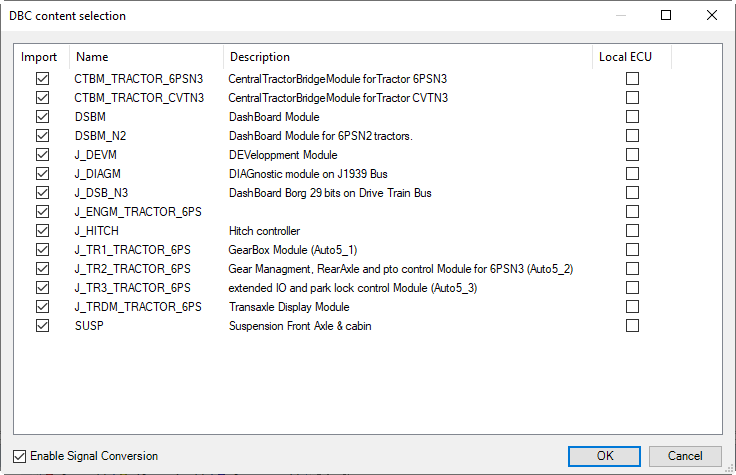

# Dialog: DBC content selection

|  |  |
| --- | --- |
| **Import** | : The ECU is imported. |
| **Name** | ECU name (from DBC file) |
| **Description** | ECU description (from DBC file) |
| **Local ECU** | : The ECU is imported as a local ECU.  : The ECU is imported as a remote ECU. |

|  |  |
| --- | --- |
| **Enable signal conversion** | : The signal conversion is enabled for all signals of the ECU. |

|  |  |
| --- | --- |
| **OK** | Inserts the selected ECUs below the J1939 Manager.  Note: The ECU name in the device tree corresponds to the name in the DBC file.  However, existing ECUs are not overwritten. The ECUs to be imported are provided with unique names. |

**Example**

9.0

© Copyright 2025, CODESYS GmbH