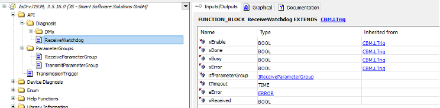

# Watching an Individual Parameter Group

Because the global communication watchdog monitors all parameter groups of a device, the failure of an individual parameter group might not be detected. In these cases, it makes sense to watch individual parameter groups. With the function block `ReceiveWatchdog`, you can check whether or not the parameter groups are received regularly. The function block requires an instance of the function block `ReceiveParameterGroup` as an input to which the respective PGN to be watched is communicated.

The outputs of the function block `ReceiveWatchdog` show whether or not the parameter group has been received in the current cycle and whether or not a timeout exists.

9.0

© Copyright 2025, CODESYS GmbH