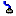
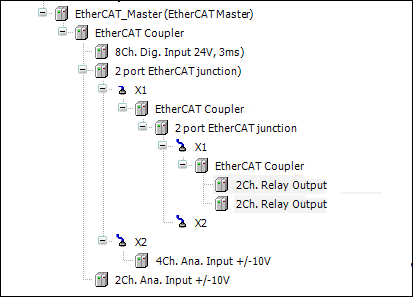

# EtherCAT Topology

In addition to the line and tree topology, CODESYS also supports the EtherCAT star topology. Special EtherCAT branches (a 2-port EtherCAT junction in the example) are required for the configuration of an EtherCAT star topology. A modular EtherCAT star can be created by using of multiple branches. As a result, individual devices or complete EtherCAT lines can be connected with the branches. An EtherCAT branch is identified by the  symbol.

14.0

© Copyright 2026, CODESYS GmbH