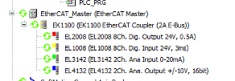

# Requirements

Note the requirements which must be considered when using the CODESYS Control Win and CODESYS Control RTE V3 runtime systems and EtherCAT devices.

**Creating and scanning a project**

1. Install the EtherCAT device descriptions (ESI XML files) of the deployed devices into the device repository.
2. Download the changed project to the controller again and start it.

   * After a few seconds, the devices become functional and are displayed in the device tree with a green arrow.

     

| NOTICE | |
| --- | --- |
|  |  |

14.0

© Copyright 2026, CODESYS GmbH