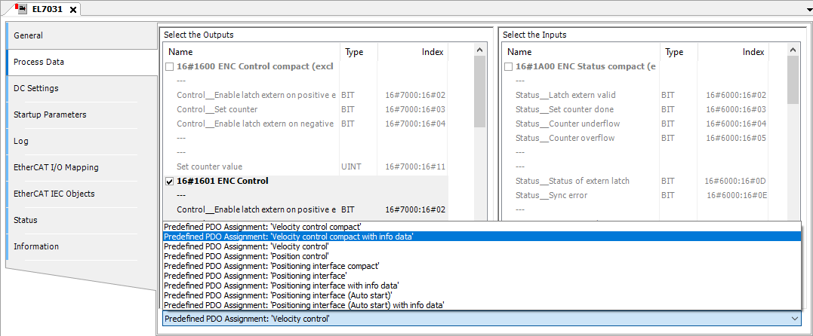

# Tab: EtherCAT Slave – Process Data

The tab displays the process data for the inputs and outputs of the slave. The data is predefined from the device description file.

Select the Outputs

|  |  |
| --- | --- |
| The table shows the outputs of the slave defined by **Start address**, **Type**, and **Index**.  If outputs of the device are enabled here (for writing), then these outputs can be assigned to project variables in the **EtherCAT I/O Mapping** dialog. | |

Select the Inputs

|  |  |
| --- | --- |
| The table shows the inputs of the slave defined by **Name**, **Type**, and **Index**.  If inputs of the device are enabled here (for reading), then these inputs can be assigned to project variables in the **EtherCAT I/O Mapping** dialog. | |

List box with predefined PDO assignments

|  |  |
| --- | --- |
| If vendor-specific tags (non-standardized tags) are defined in the ESI file of the EtherCAT Slave, then alternative Sync Manager assignments are available. You can toggle between these PDO assignments. To do this, select the desired predefined PDO assignment from the list box. | |

**Example**

Process data of a EtherCAT Slave

14.0

© Copyright 2026, CODESYS GmbH