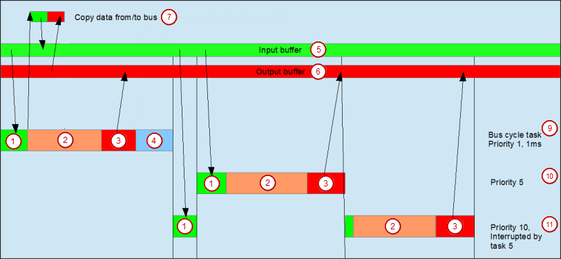

# Frame at task start

If the `FrameAtTaskStart` property is set to `FALSE`, then the timing is as follows:

If the `FrameAtTaskStart` property is set to `TRUE`, then the timing is as follows:

*  Read inputs from input buffer
*  IEC task
*  Writing the outputs in the output buffer
*  Bus cycle
*  Input buffer
*  Output buffer
*  Copy data to/from bus
*  Bus cycle task, priority 1, 1 ms
*  Bus cycle task, priority 5
*  Bus cycle task, priority 10, interrupted by task 5

14.0

© Copyright 2026, CODESYS GmbH