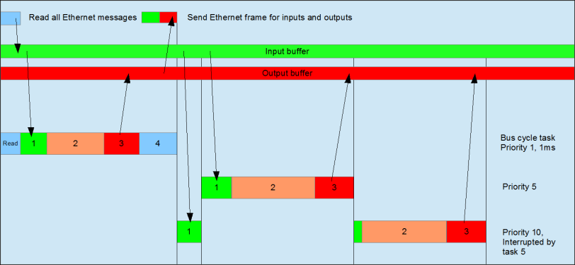
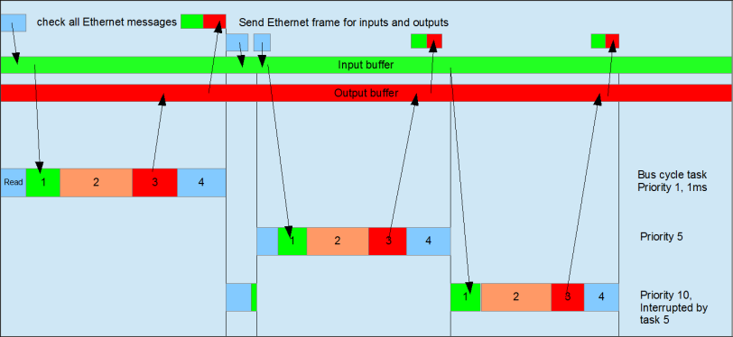

# Behavior of the bus cycle for EtherCAT

Before the IEC inputs are copied, the pending network messages of the last cycle are read.

When the **Messages per task** option is enabled in the settings of the EtherCAT Master, additional telegrams are transmitted to the devices employed per task and input or output employed. Channels that are used in a slow task are also transmitted less frequently. As a result, the bus load can be reduced.

14.0

© Copyright 2026, CODESYS GmbH