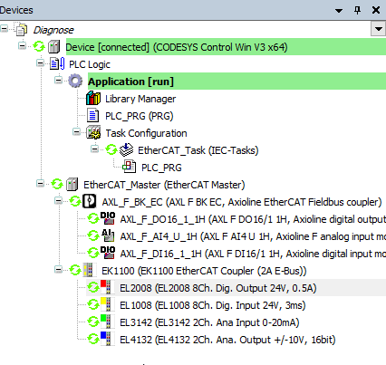

# Device tree

**In online mode, the device tree allows for a pinpointing of a pending diagnosis.**

* Green symbol: The device is in the `OPERATIONAL` state.
* Orange triangle: The device is in the `PREOPERATIONAL` state and is configured, and it is still not in the `OPERATIONAL` state.
* Error flag (red triangle): Hard error, such as an incorrect/missing device or connection interruption.
* Diagnosis flag (red exclamation mark): Indicates that a diagnosis entry is currently available for exactly this device. The details are then displayed on the status page of the respective device.
* Error-cleared flag (gray exclamation mark): Indicates that a previously pending error has been corrected.

14.0

© Copyright 2026, CODESYS GmbH