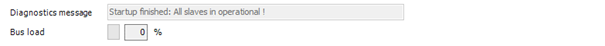
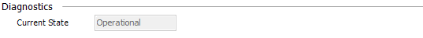

# EtherCAT – General (Master and Slave)

In online mode, the state of the device is displayed on the **General** tab for the EtherCAT Master and Slave.

In the case of the master, any errors or messages are displayed as text as well as the bus load:

In the case of the slave, the current state of the device is displayed.

For more information, see: [Tab: EtherCAT Master – General](_ecat_edt_master_master.html#_ecat_edt_master_master) and [Tab: EtherCAT Slave – General](_ecat_edt_slave_slave.html#_ecat_edt_slave_slave)

State of the slave

| Value | Description |
| --- | --- |
| `Bootstrap` | State for firmware downloads |
| `Init` | Communication is established. |
| `Pre-Operational` | Mailbox communication is possible, but process data is not transferred |
| `Safe Operational` | Process data has already been transferred. Inputs are read, but outputs are not given. |
| `Operational` | Communication has been established, and all process data is transferred. |

14.0

© Copyright 2026, CODESYS GmbH