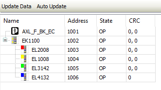

# Overview Page in the Master

All slaves and their statuses are displayed together on the **[Overview](_ecat_edt_master_overview.html#_ecat_edt_master_overview)** tab.

Each EtherCAT Slave is listed with its physical address, status, and any error counters. The error counters (CRC) are read from each device for the active connection and also show problems (EMC) with the wiring between the devices.

Example: A value of `12.0` for **CRC** means that 12 frames with CRC errors were received at the first port, and none at the second port.

For more information, see: [Tab: EtherCAT Master – Overview](_ecat_edt_master_overview.html#_ecat_edt_master_overview)

14.0

© Copyright 2026, CODESYS GmbH