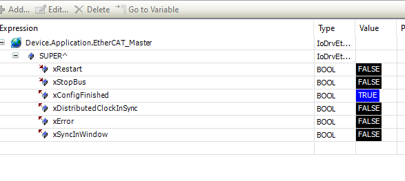

# IEC Objects – Master

The driver instance and its inputs and outputs are displayed on the **IEC Objects** tab of the master. You can use the outputs to check whether or not the configuration has completed. In the case of **Distributed Clock**, you can see whether or not the controller is synchronized.

14.0

© Copyright 2026, CODESYS GmbH