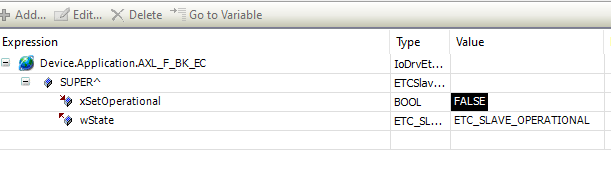

# IEC Objects – Slave

The respective slave instance is displayed on the **IEC Objects** tab of the slave. The **wState** output returns the current state of the slave.

14.0

© Copyright 2026, CODESYS GmbH