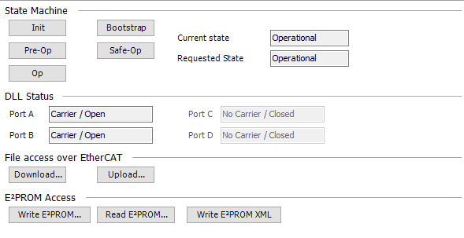

# Online Page for the Slave

If the controller is in online mode and the **Expert settings** option is selected, then the additional **[Online](_ecat_edt_slave_online.html#_ecat_edt_slave_online) tab** is displayed.

The current status of the device is displayed on this tab.

In addition, the status of the EtherCAT connections are displayed.

For more information, see: [Tab: EtherCAT Slave – Online](_ecat_edt_slave_online.html#_ecat_edt_slave_online)

14.0

© Copyright 2026, CODESYS GmbH