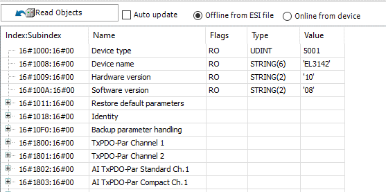

# CoE Online Display for the Slave

If the **Expert settings** option is selected, then the additional **[CoE Online](_ecat_edt_slave_coe_online.html#_ecat_edt_slave_coe_online) tab**  is displayed with all CoE objects and their current values.

Here you can find and directly correct an incorrect parameters.

For more information, see: [Tab: EtherCAT Slave – CoE Online](_ecat_edt_slave_coe_online.html#_ecat_edt_slave_coe_online)

14.0

© Copyright 2026, CODESYS GmbH