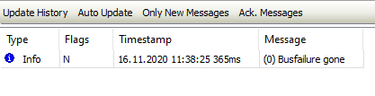

# Diagnosis History for the Slave

All messages in the respective slave are displayed on the **[Diagnostics History](_ecat_edt_slave_diagnosis_history.html#_ecat_edt_slave_diagnosis_history) tab**. The visibility of this tab depends on the devices used.

For more information, see: [Tab: EtherCAT Slave – Diagnostics History](_ecat_edt_slave_diagnosis_history.html#_ecat_edt_slave_diagnosis_history)

14.0

© Copyright 2026, CODESYS GmbH