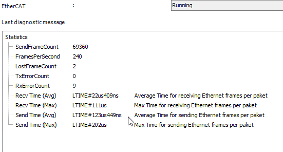
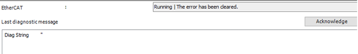

# Status Page (Master and Slave)

Different error counters are displayed on the **Status** tab of the master. Normally all counters should be 0.

The various time values each indicate the time required to send and receive messages. As a result, the properties of the respective operating system as well as the network driver can be displayed.

| Value | Description |
| --- | --- |
| `LostFrameCount` | Number of lost packages.  This usually indicates a connection error or a problem with electromagnetic compatibility (EMC). |
| `TxErrorCount` | Displays packages which cannot be sent.  This may, for example, be due to insufficient internal buffers of the operating system. |
| `RxErrorCount` | Displays lost or delayed messages.  This may be caused by an overload of the operating system, which means that incoming messages are no longer forwarded to the EtherCAT stack in time. |

A diagnosis message is displayed on the **Status** tab of the slave if errors have occurred. For example, an emergency message is displayed.

For more information, see: [EtherCAT Status](_ecat_diagnosis_application_status.html#_ecat_diagnosis_application_status)

14.0

© Copyright 2026, CODESYS GmbH