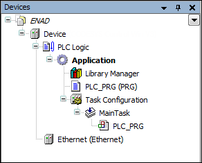

# CODESYS Ethernet Adapter

TIP:

See the general description for information about the following tabs of the device editor.

* [Tab: <device name> I/O Mapping](../../../../../../api/crossBook?lang=en-US&virtualBookName=SoMProg&topicID=D_SE_0083399)
* [Tab: <device name> IEC Objects](../../../../../../api/crossBook?lang=en-US&virtualBookName=SoMProg&topicID=D_SE_0106082)
* [Tab: <device name> Parameters](../../../../../../api/crossBook?lang=en-US&virtualBookName=SoMProg&topicID=D_SE_0087840)
* [Tab: <device name> Status](../../../../../../api/crossBook?lang=en-US&virtualBookName=SoMProg&topicID=D_SE_0083395)
* [Tab: <device name> Information](../../../../../../api/crossBook?lang=en-US&virtualBookName=SoMProg&topicID=D_SE_0083396)

An additional separate help page for the relevant device editor is available only in the case of special features.

If the "<device name> Parameters" tab is not displayed, then select the **Show generic device configuration views** option in the CODESYS options, in the **Device editor** category.

The CODESYS Ethernet adapter is used as a parent node for devices that use Ethernet-based protocols. CODESYS currently supports EtherNet/IP, Modbus, and PROFINET IO.

First, you insert the Ethernet adapter below the controller. Then you add the Ethernet-based fieldbus below the adapter.

4.0

© Copyright 2025, CODESYS GmbH