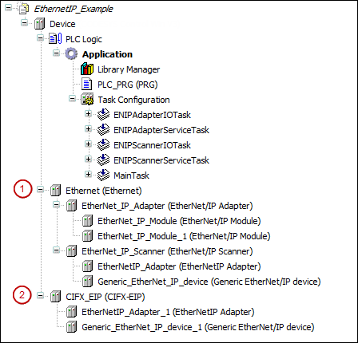

# General

**CODESYS provides two different EtherNet/IP Scanners.**

* (1): A device which you can insert directly below each network adapter. An Ethernet/IP Scanner (IEC) can also be an adapter at the same time – functionally an originator and an adapter in one.
* (2): A device for which you need a special CIFX card

Add one or more EtherNet/IP adapters below a scanner.

9.0

© Copyright 2025, CODESYS GmbH