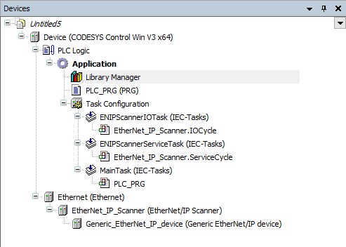

# Inserting an EtherNet/IP Scanner

1. Create a new project with the CODESYS Control Win controller.
2. Configure the adapter settings.

   For example: **IP address** or **Connections**

TIP:

A generic remote adapter is included in the standard installation of CODESYS Development System. This remote adapter is not preconfigured and should only be used by advanced users.

TIP:

You can also add the used devices by means of the **Scan for Devices** command. For more information, see: [Command: EtherNet/IP – Scan for Devices](_enic_cmd_scan_for_devices.html#_enic_cmd_scan_for_devices)

9.0

© Copyright 2025, CODESYS GmbH