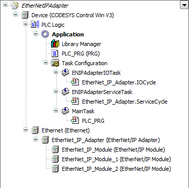

# General

**CODESYS runtime system as EtherNet/IP Adapter**

First, you insert the EtherNet/IP Adapter below an Ethernet adapter. Then, you insert the modules below the EtherNet/IP Adapter.

The sum of the input and output data of the modules determines the connection size of the adapter.

9.0

© Copyright 2025, CODESYS GmbH