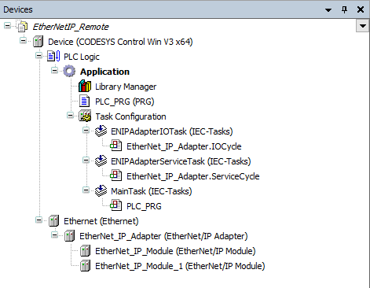

# Inserting an EtherNet/IP Local Adapter

1. Create a new project with the CODESYS Control Win controller.
2. Configure the individual modules.

   On the **Assemblies** tab, you can add parameters which result in the I/O mapping for the connections of the adapter.

9.0

© Copyright 2025, CODESYS GmbH