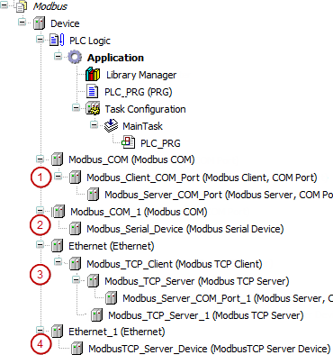

# CODESYS Modbus

TIP:

See the general description for information about the following tabs of the device editor.

* Tab: <device name> I/O Mapping
* Tab: <device name> IEC Objects
* Tab: <device name> Parameters
* Tab: <device name> Status
* Tab: <device name> Information

An additional separate help page for the relevant device editor is available only in the case of special features.

If the "<device name> Parameters" tab is not displayed, then select the **Show generic device configuration views** option in the CODESYS options, in the **Device editor** category.

A Modbus network consists of a Modbus Client and one or more Modbus Servers. A maximum of 64 servers can be inserted below a client. The Modbus devices can be linked via serial port or Ethernet.

**Modbus devices, linked via the serial port using the **Modbus COM Port** device.**

* (1): The CODESYS runtime acts as a Modbus Client.
* (2): The CODESYS runtime acts as a Modbus Server. This Modbus Server is named "Modbus Device" in the following text.

  For Modbus serial, the operating type "Modbus RTU" is supported.

**Modbus devices, linked in an Ethernet network using the **Ethernet Adapter** device.**

* (3): The CODESYS runtime acts as a Modbus Client.

  A Modbus TCP Server can also act as a gateway for serial Modbus Servers.
* (4): The CODESYS runtime acts as a Modbus Server.

You can configure communication parameters in the Modbus configuration pages and then create Modbus channels. A Modbus channel includes a single Modbus command (read/write data) as well as the respective I/O channels.

10.0

© Copyright 2025, CODESYS GmbH