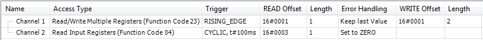
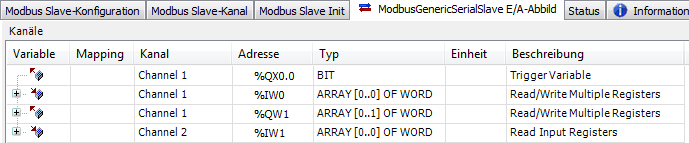

# Dialog: Modbus Channel

Channel

|  |  |
| --- | --- |
| **Name** | A string that contains the name of the channel |
| **Access type** | * **Read Coils (function code 01)** * **Read Discrete Inputs (function code 02)** * **Read Holding Registers (function code 03)** * **Read Input Registers (function code 04)** * **Read Single Coil (function code 05)** * **Write Single Register (function code 06)** * **Write Multiple Coils (function code 15)** * **Write Multiple Registers (function code 16)** * **Read/Write Multiple Registers (function code 23)** |
| **Trigger** | * **CYCLIC**: The request occurs periodically. * **RISING\_EDGE**: The request occurs as a reaction to a rising edge of the Boolean trigger variables. The trigger variable is defined on the **I/O Mapping** tab. * **Application**: The Modbus request is triggered by the PLC application. This happens by means of the [ModbusChannel](_mod_lib_modbuschannel.html#_mod_lib_modbuschannel) function block, which is included in the respective I/O driver library. This function block provides complete control of and information about the execution of this command, for example the start time, the processing time, and the result. |
| **Cycle Time (ms)** | For Trigger = **CYCLIC**: Request interval  Note: The request interval should be the same as or a multiple of the cycle time of the application. |
| **Comment** | Description of the channel |

READ Register

|  |  |
| --- | --- |
| **Offset** | Start address where reading should start (value range 0–65535) |
| **Length** | Number of registers to be read (for word access) or number of discrete inputs to be read (for bit access) |
| **Error handling** | **Defines what should happen to the data in case of a communication error**   * **Keep last Value** * **Set to zero** |

WRITE Register

|  |  |
| --- | --- |
| **Offset** | Number of the register to be written to (value range 0–65535) |
| **Length** | Number of registers to be written to (= words)  The value range of the parameter depends on function code. |

IMPORTANT:

**Reading of coils and discrete inputs / Writing of coils to overlapping register memory**

The CODESYS MODBUS I/O driver allows for the reading of coils and discrete inputs, as well as the writing of coils to overlapping register memory (the **Discrete Bit Areas** check box not selected). In this case, the first 8 bits which are read (%IB0) or written align with the high byte of the corresponding register. The second 8 bits which are read (%IB1) align with the low byte of the corresponding register (LSB first).

**Example**

In the following example, the first line defines a combined read/write operation (function code 23). It reads a word from the "holding register" with offset `16#0001` and writes two words to the register with offset `16#0003`. The operation is performed as soon as the trigger variable defined on the **I/O Mapping** tab shows a rising edge.

10.0

© Copyright 2025, CODESYS GmbH