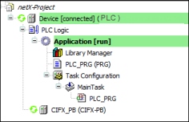

# 3. Creating a NetX configuration for a project

1. In CODESYS, click **File → New Project** to create a new standard project. In the **New Project** dialog, select the **Standard Project** template.
2. Log in to the controller and click **Debug → Start** to start the application.

   * 

     If there are no error messages, then the NetX adapter has been configured correctly and you can now continue developing the project.

5.0

© Copyright 2025, CODESYS GmbH