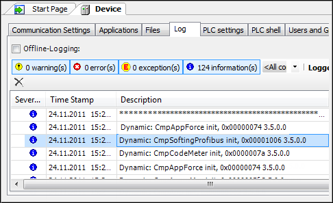

# Adding USB Interfaces for PROFIBUS

TIP:

The PROFIusb interface functions only in the Windows operating system and it is not real-time capable.

Requirement: The driver must be installed in Windows. The driver and the manual are included in the standard scope of delivery for the adapter, or they can be downloaded from the Softing website.

1. Insert the "PROFIusb" object into the device tree below the PLC.
2. Check that the component is loaded. Do this by opening the PLC configurator and selecting the **Log** tab.

   From the **Dynamic: cmpSoftingProfibus init** entry, you can see that the components are loaded.

   * 

5.0

© Copyright 2025, CODESYS GmbH