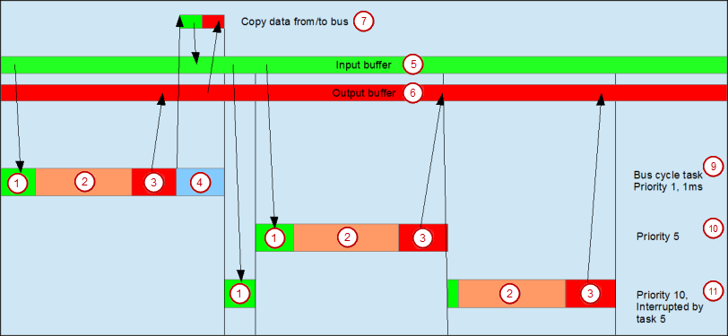

# General Information

Generally, for each IEC task, the used input data is read at the start of each task (1) and the written output data is transferred to the I/O driver at the end of the task (3). The implementation in the I/O driver is decisive for additional transfer of the I/O data. It is responsible for the time frame and time point that the actual transfer to the corresponding bus system occurs.

The bus cycle task of the PLC can be defined globally for all fieldbuses in the PLC settings. For some fieldbuses, however, you can change this independent of the global setting. The task with the shortest cycle time is used as the bus cycle task (setting: **unspecified** in the PLC settings). The messages are normally sent on the bus in this task.

Other tasks copy only the I/O data from an internal buffer that is exchanged only with the physical hardware in the bus cycle task.

(1) Read inputs from input buffer

(2) IEC task

(3) Write outputs to output buffer

(4) Bus cycle

(5) Input buffer

(6) Output buffer

(7) Copy data to/from bus

(9) Bus cycle task, priority 1, 1 ms

(10) Bus cycle task, priority 5

(11) Bus cycle task, priority 10, interrupted by task 5

**Task usage**

The **Task Deployment** tab provides an overview of used I/O channels, the set bus cycle task, and the usage of channels.

| WARNING | |
| --- | --- |
|  | If an output is written in various tasks, then the status is undefined, as this can be overwritten in each case.  If the same inputs are used in various tasks, then it is possible for the input to change during the processing of a task. This happens when the task is interrupted by a task with a higher priority and causes the process image to be read again. Solution: At the beginning of the IEC task, copy the input variables to variables and then work only with the local variables in the rest of the code.  Conclusion: Using the same inputs and outputs in several tasks does not make any sense and can lead to unexpected reactions in some cases. |

5.0

© Copyright 2025, CODESYS GmbH