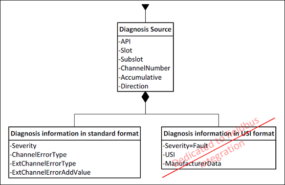

# Diagnosis Database

Every error that occurs in a PROFINET Device (for example, of type "broken cable" or "power surge") is stored in a local diagnosis database in the PROFINET Device. The error is also deleted from there again when the error cause has been corrected. The entries in this diagnosis memory can be read at any time via acyclic services. This can be done with both a PROFINET Controller and a "supervisor" tool that does not exchange data with the PROFINET Device.

**The diagnosis information exists in two different variants, whereby the USI format should be used in exceptional cases only. The format cannot be evaluated without the associated GSDML file. The GSDML file contains the information which belongs to the individual device and the USI. The standard format basically consists of the following:**

* ChannelErrorType:

  Main error type. As predefined by the standard, the usual error types are e.g. 1 = "Short Circuit".
* ExtChannelErrorType (optional):

  Detailed information about the main error. Value depends on the main error.

9.0

© Copyright 2025, CODESYS GmbH