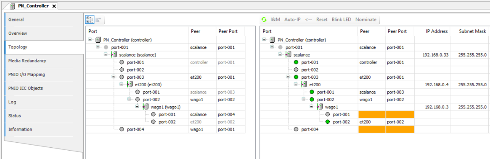

# Media Redundancy (MRP)

Media redundancy (based on MRP – Media Redundancy Protocol) is a function for increasing the system availability by means of redundant communication paths. Standard Ethernet allows for only a single, unique data path (line and star topologies) to one network participant. MRP allows for the physical closing of a line topology to one ring. As a result, the participant can be reached over two paths.

All participants of an MRP ring (also: "MRP domain") have to be configured as a media redundancy client (MRC) and at least one of them as a media redundancy manager (MRM). If there is no physical malfunction of the rings, then the MRM interrupts the ring to prevent an infinite loop of Ethernet data. When a malfunction is detected, the MRM opens the ring and the participants in the disconnected network segment can be reached again.

Media redundancy can be combined with other redundancy mechanisms such as system redundancy. It is possible to configure multiple rings and (if the devices support it) also multiple configured rings. Devices that do not support MRP themselves can be attached to an MRP ring as passive participants (from an MRP perspective). One example is an MRP ring of switches to which the remaining participants are attached as in a classic star topology. Media redundancy is negotiable for standard Ethernet protocols and therefore not limited to PROFINET communication.

**Configuration / Commissioning:**

1. In the topology editor, configure the port switching of the PROFINET Devices.

   In the simplest case, a real existing line topology, which is not yet closed to the ring, can also be imported into the project using the import function. Then close the ring in the configuration.

   * Result:

     
2. After successful configuration, you can now close the ring physically.

IMPORTANT:

In the case that the ring is interrupted, the reconfiguration of the ring may cause a temporary interruption of the PROFINET communication. This is the case when the interruption is longer than the watchdog time set for the PROFINET connection. This time depends on the number of devices (maximum of 50 devices per ring) as well as the type of device. The total time is always less than 200ms and can also be significantly shorter.

9.0

© Copyright 2025, CODESYS GmbH