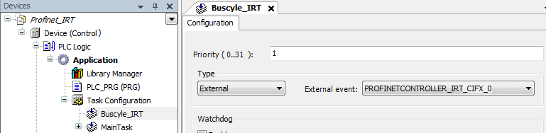

# PROFINET IRT

PROFINET IRT (isochronous real time) is a type of clocked communication that is optimized for maximum performance. It is often used for motion control applications.

IMPORTANT:

This PROFINET communication class is currently available only for Hilscher CIFX-Karten with FW > 3.1.x.x (in the CODESYS setup: `../GatewayPLC/HilscherCIFX/Firmware/cifxpnm.nxf`).

In order to send clocked I/O data from the application, the interrupt-triggered bus cycle is necessary (for synchronization between the I/O application and the CIFX hardware). This is currently possible only with RTE Vx >= V3.5 SP9, as well as Linux and Hilscher kernel module.

**Specific steps should be noted during configuration:**

* The IRT communication is activated by setting the RT class of a PROFINET Slave to RTC 3.
* For all IRT devices ("IRT domains"), the network topology (that is, the connectivity of the Ethernet ports) must be recognized internally. This setting is performed in the **[Topology](_pnio_edt_controller_topology.html#_pnio_edt_controller_topology)** tab of the PROFINET Master.

  In addition, the cable length between the devices must be defined. A default value of 100m is specified. This setting is performed in the **Options** tab of the PROFINET Device.
* A mixed operation between RT and IRT is possible. However, the IRT domains must not be interrupted by RT devices or non-IRT capable switches. This means that the IRT devices at the controller follow immediately "after" the RT devices.
* In order to send the clocked I/O data from the application, the bus cycle task has to be set to **External** and the interrupt mode must be activated in the CFG file (`[CmpHilscherCIFX] InterruptMode=1`).

9.0

© Copyright 2025, CODESYS GmbH