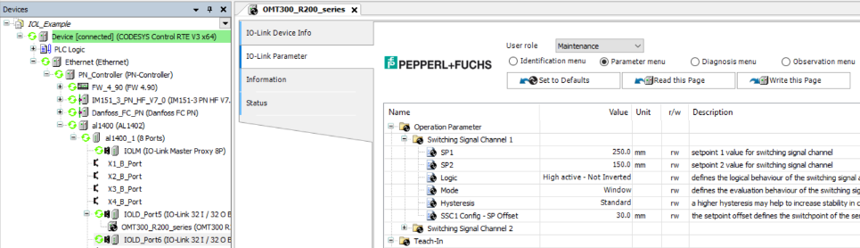

# IO-Link integration

IO-Link devices such as PROFINET Modules or Devices with the IO-Link Master Function (IOLM) and connected IO-Link Devices (IOLD, for example sensors) can be used in principle without additional measures.

**PROFINET defines the IO-Link profile for this, which describes the mapping of the IO-Link objects and functions to PROFINET submodules:**

* IO data of the IO-Link devices are mapped to the IO data of these proxy submodules.
* Acyclic PROFINET services are used for sending IO-Link commands and transmitting parameters (see FBs in ProfinetCommon/IO-Link).
* IO-Link events and diagnoses are mapped to PROFINET alarms and diagnosis data.

Manufacturer-specific tools (PDCT – Port and Device Configuration Tool) have to be used then to perform the often very complicated parameterization of IO-Link devices. CODESYS also provides a separate licensed IO-Link plug-in. This plug-in contains configurators which use the IO-Link device descriptions (IODD) to allow for convenient parameterization. Moreover, the generic (which mean transmitted as a byte stream) IO data of the IO-Link devices is prepared with the description data from the IODD. Another advantage is the backup of the IO-Link device parameters in the CODESYS project.

For the configuration by means of a CODESYS IO-Link, the IODD has to be imported, and the resulting generated IO-Link device has to be inserted below the IOLD proxy submodule in the device tree.

When an IODD Device is added below an IOLD proxy submodule, an **IO-Link Integration** tab is displayed for this object. More settings are possible there.

|  |  |
| --- | --- |
| **Download IODD-IO configuration** | : The IODD device is not only used for the configuration (IO-Link parameter), but also downloaded to the controller.  An additional I/O mapping is generated which, instead of the generic byte stream, provides an I/O mapping which is prepared with information from the IODD.  The generic inputs at the PROFINET submodule are still available. Any existing inputs at the PROFINET submodule are no longer evaluated for reasons of consistency. |
| **Adapt provider ID and device ID** | : The provider ID and device ID in the PROFINET submodule settings are automatically adapted to the subordinate IODD device. |

9.0

© Copyright 2025, CODESYS GmbH