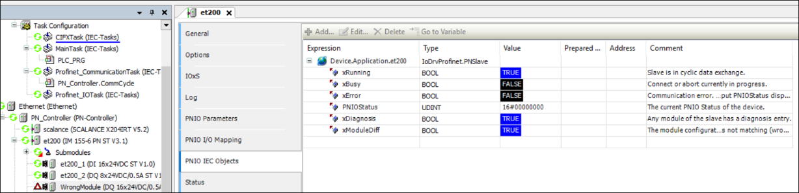

# Device Function Block

For each PROFINET Device in the device tree, a function block is created that provides basic information about the connection or configuration status of the device. For example, to request diagnosis entries or for a deviating module configuration.

Similarly, a function block instance is also created for the controller to provide information about the operating status of the PROFINET Controller.

For more information, see: `IoDrvProfinet.ProfinetController` and `IoDrvProfinet.PNSlave`

9.0

© Copyright 2025, CODESYS GmbH