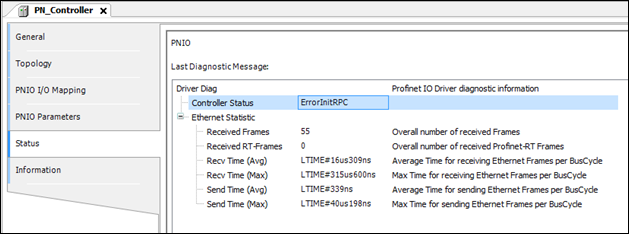
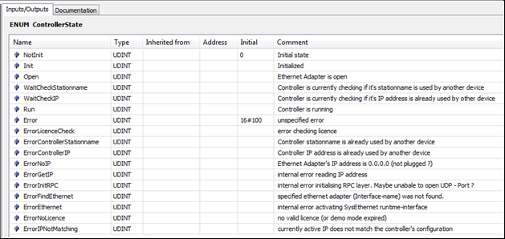
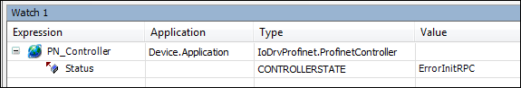

# Status dialog in the device configurator

If the object of the PROFINET Controller or PROFINET Device has a red symbol in the device tree, or if no communication is taking place at all, then take a look at the **Status** tab in the device configuration dialog.

Here we are looking at the controller only. The same basically applies to the device.

The most important fields in the diagnosis structure displayed here are as follows:

**Controller status**:

Current status of the controller; the individual values correspond to the enumeration `Profinet.ControllerState`:

Specific conclusions about problem sources can often be drawn from these values, for example for license issues or doubled station names.

The status value is also available in the PLC application:

**Received frames** / **Received RT frames**:

Under specific conditions, the controller status switches to "Run", but communication is still not possible. The values **Received frames** / **Received RT frames** can provide more information:

**Received frames** shows the number of all Ethernet frames that were received over the Ethernet interface. **Received RT frames** shows the subset of the PROFINET RT frames.

If both counters remain at `0` after starting the controller although the device is in a network, then this indicates basic problems with the runtime component `SysEthernet`.

If only **Received frames** increments but not **Received RT frames** although PROFINET devices are in the network, then this indicates a problem with the runtime configuration (firewall, package filter, etc.).

**Invalid Cyclic Frames**:

When the counter increments, this indicates problems with the runtime component `SysEthernet` or the Ethernet driver. Received PROFINET frames are rejected as faulty. UDP/Ethernet adapters are often the cause. Use the internal Ethernet adapters of the system.

**Send Errors**:

The counter shows the failed attempts at sending data via the Ethernet adapter. When the value is > 1, this indicates problems with the runtime component `SysEthernet` or the Ethernet driver.

**Recv Time** / **Send Time**:

The maximum value and the average value are displayed here for both sending and receiving of the Ethernet frame. The values indicate the performance for the link to the Ethernet adapter (runtime interface `SysEthernet`).

Very high values (> 500 us) indicate a system overload or an interruption of the real-time behavior. Under some circumstances, this leads to unstable communication (connection interruption with DHT error). Only very long send intervals (> 8 ms) may be possible. For example, typical values for CODESYS Control RTE with 10 slaves and a 1ms send interval are 20–30 us, for Linux /ARM 200–300 us.

9.0

© Copyright 2025, CODESYS GmbH