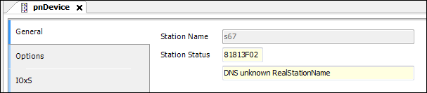

# PROFINET Slave configurator

In the case of a failed connection (slave symbol is red), the cause is displayed in the **General** tab of the device configuration dialog. (`PNIOStatus` according to PI Specification: Application Layer protocol for decentralized periphery Technical Specification for PROFINET IO, Version 2.3Ed2MU2, Date: February 2015, Order No.: 2.722)

9.0

© Copyright 2025, CODESYS GmbH