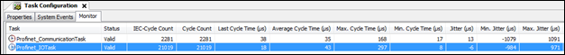

# Task monitor (monitoring)

On weak systems or systems with a poor link to the Ethernet component (`SysEthernet`), connection disruptions can be caused by jitter or high cycle times.

This mainly affects the controller. The device is not critical in this case.

The **Monitoring** tab in the **Task Configuration** helps to detect these problems.

Important is the **Profinet\_IOTask** in which the PROFINET RT data packages are transmitted in a fixed send clock. If this send clock cannot be maintained, then the connection is terminated by the communication watchdog "DataHoldTimer" of the PROFINET Devices.

As recommended values, the average cycle time should not exceed 250 µs and the maximum cycle time should not exceed 1 ms.

Therefore, the **Profinet\_IOTask** should run as high priority, and other IEC tasks should not block the **Profinet\_IOTask** (same or higher priority). In the context of this task, no blocking or long-lasting calls should occur.

9.0

© Copyright 2025, CODESYS GmbH