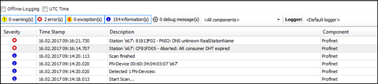

# Log view of the PLC

In case of error in the configuration or an interruption of the connection, the PROFINET driver may provide more information in the log view of the device configurator of the PLC:

9.0

© Copyright 2025, CODESYS GmbH