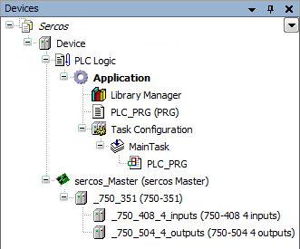

# CODESYS Sercos

TIP:

See the general description for information about the following tabs of the device editor.

* [Tab: <device name> I/O Mapping](../../../../../../api/crossBook?lang=en-US&virtualBookName=SoMProg&topicID=D_SE_0083399)
* [Tab: <device name> IEC Objects](../../../../../../api/crossBook?lang=en-US&virtualBookName=SoMProg&topicID=D_SE_0106082)
* [Tab: <device name> Parameters](../../../../../../api/crossBook?lang=en-US&virtualBookName=SoMProg&topicID=D_SE_0087840)
* [Tab: <device name> Status](../../../../../../api/crossBook?lang=en-US&virtualBookName=SoMProg&topicID=D_SE_0083395)
* [Tab: <device name> Information](../../../../../../api/crossBook?lang=en-US&virtualBookName=SoMProg&topicID=D_SE_0083396)

An additional separate help page for the relevant device editor is available only in the case of special features.

If the "<device name> Parameters" tab is not displayed, then select the **Show generic device configuration editors** option in the CODESYS options, in the **Device editor** category.

A Sercos network in equipped with a master, which is responsible for the coordination in the network, and at least one slave. Slaves can be set up modularly.

You add the Sercos Master directly below the PLC. You add the slaves and modules below the master. To do this, you first have to install the device description files in the device repository. The device description files, Sercos III XML (\*.xml), are provided with the hardware. The library `IODrvSERCOS3` is added automatically to the Library Manager when you insert a Sercos Master into the project.

4.0

© Copyright 2025, CODESYS GmbH