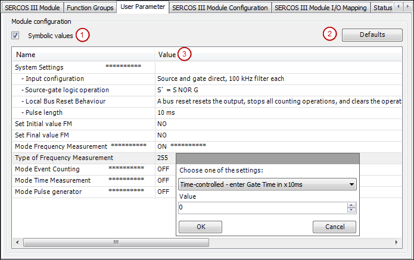

# Example dialog: User Parameter

Depending on the device description, the dialog has the following appearance:

**Symbolic values** (1) Shows the symbolic value instead of the numeric value.

**Defaults** (2): Reset to default settings.

Double-clicking the **Value** column (3) opens a list box with the defined parameter values. For some parameters, a user-defined value can be entered into the input field. If a predefined value is selected, then the input field is disabled.

4.0

© Copyright 2025, CODESYS GmbH