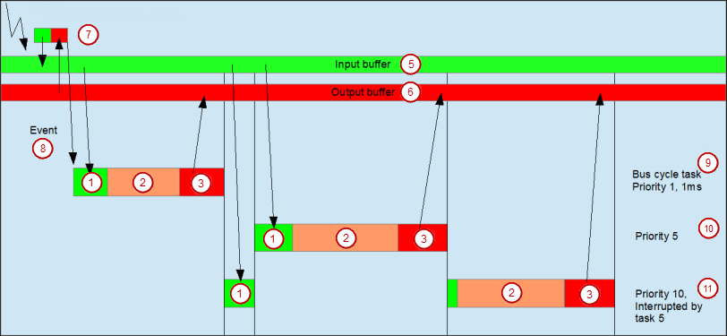

# Behavior of the bus cycle for Sercos III

The I/O data is transferred with the cycle time as defined in the master. The data is transferred independently by the Sercos Master.

The data transfer is synchronized automatically when a cyclic task is set for the Sercos Master. Note that the cycle time of the bus cycle task is less than the Sercos cycle time.



```
(8) Event
```

4.0

© Copyright 2025, CODESYS GmbH