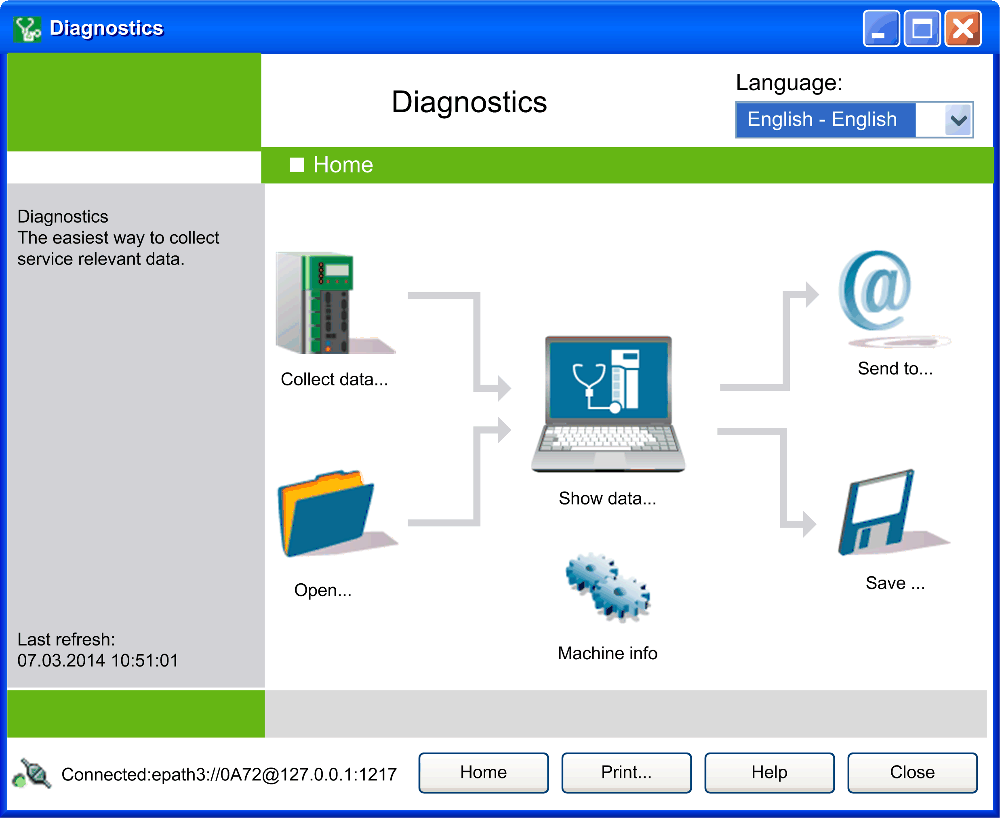

# Introduction

## Overview

Error analysis is a central topic in industrial automation. The Diagnostics tool addresses this topic with comprehensive support. You can access the service data of a EcoStruxure Machine Expert system using the program screen. You can display data according to your preferences, save it, or forward it directly to a service location.

Diagnostics works without any installed EcoStruxure Machine Expert development system and requires only the gateway that was delivered with it to connect to a controller. The Diagnostics tool is compatible with the controllers regardless of their firmware versions. However, in general, the tool is most efficient with the latest versions of controller firmwares installed.

The Home window provides access to the main functions. By clicking the icons, you reach the corresponding submenu. Click the Collect data... icon to [connect to a controller](D-SE-0042143.html#D-SE-0042143).

Once you have decided on the connection type and entered the necessary information, data collection can begin.

You can display, [save or send the identified data via e-mail](D-SE-0041410.html#D-SE-0041410).

After the data has been identified, the collected objects of the Diagnostics system, as well as their values, are available for display by clicking the icon Show data...  in the Home  window.

If data is collected for multiple machines, you can establish a mapping by clicking the Machine info icon in the  Home window. The  Machine information [dialog box](D-SE-0041429.html#D-SE-0041429) opens that allows you to enter additional notes, such as user, machine name, or comments. The hardware code of the controller is automatically added.

EIO0000002005.05