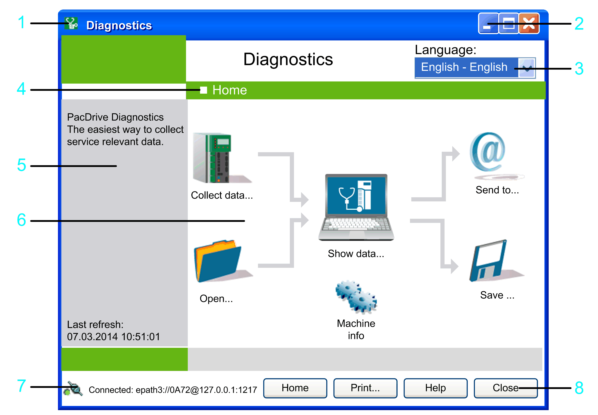

# Home

## Presentation

The  Home window opens after start of the Diagnostics. In the top right (legend item 3 in the following graphic), you can select the desired language.

The main elements are in the middle of the window (6). To perform a function, click a symbol that works as a button. Functions which are not available appear in reduced intensity.

The Home  window serves as the command center for operating Diagnostics. The Home button takes you back to the Home  window at any time.

**1** System menu: Click the **Diagnostics** icon to open the system menu. Select the **About** command for information about the Diagnostics program.

**2** Minimize/maximize: Use these two buttons to maximize or minimize the Diagnostics window or return it to its original size.

**3** **Language**: Select an entry from the list to change the language.

**4** Title: Shows the title of the dialog box or data view.

**5** Left field: Provides further information on the selected window.

**6** Main elements: Symbols are used as buttons to provide access to the core functions.

**7** Connection status: Shows the status of the connection to the controller.

**8** Buttons available in most of the dialog boxes.

For more detailed information on the individual elements, refer to the description of the window [**Home**](D-SE-0041424.html#D-SE-0041424).

EIO0000002005.05