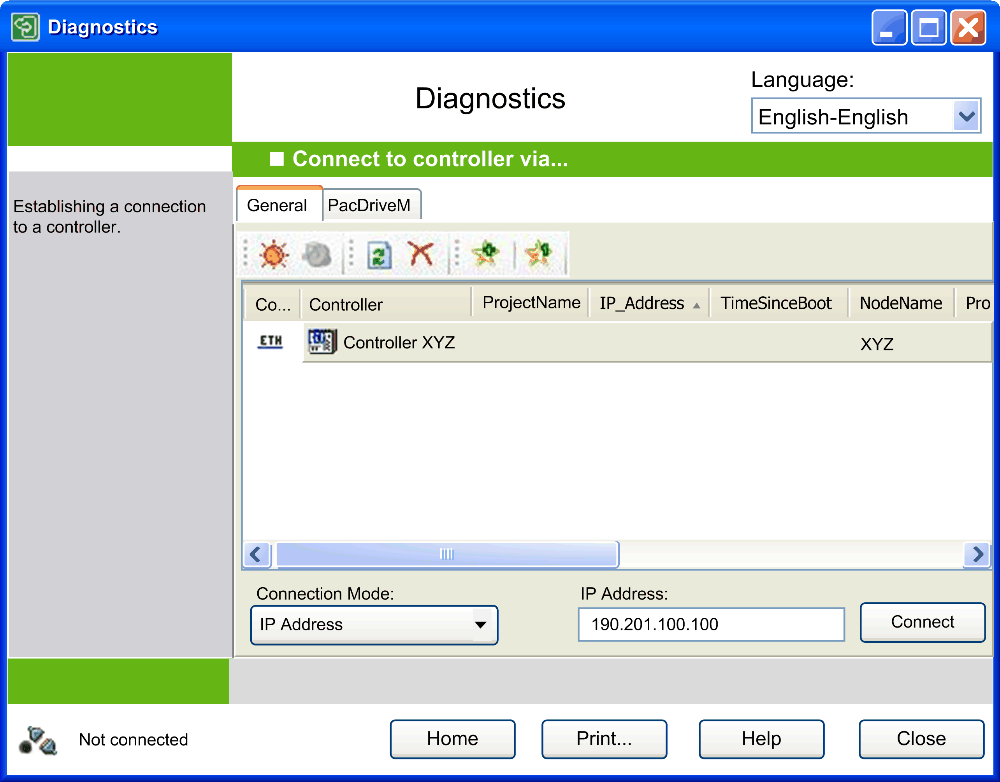

# Collecting Data

## Overview

In order to connect to a controller for collecting diagnostics data, click the button Collect data... in the [**Home** window](D-SE-0041404.html#D-SE-0041404). The  Connect to controller via... window consists of two tabs.

By default, the General tab is selected. This tab includes the Network Device Identification function and allows you to configure the controller access options. For a detailed description, refer to the window description for [Collect Data](D-SE-0042143.html#D-SE-0042143).

General tab of the Connect to controller via...  window:

To connect to a PacDrive M controller, select the PacDriveM  tab. For a detailed description, refer to the window description for [Collect Data](D-SE-0042151.html#D-SE-0042151).

NOTE: During data collection, Diagnostics is based on the configuration files of EcoStruxure Machine Expert. These are located in a [subdirectory](D-SE-0041407.html#D-SE-0041407) of Diagnostics.

Basically, Diagnostics seeks to collect the maximum amount of readable data. To achieve this, the device descriptions are searched inside Diagnostics and EcoStruxure Machine Expert Device Repositories . If the exact version is not found, the latest version is used. Data collection even works with former versions, although less data is collected than with the most recent version. If the exact controller version is not found, you are notified on collecting data. For some controllers, the required and the used versions are indicated in the view PLC configuration . Therefore, it is a good practice to have the latest version of your programs.

NOTE: If you are using a current Logic Builder version, you may replace the directory ConfigFiles by the directory of the same name in your Logic Builder installation [directory](D-SE-0041407.html#D-SE-0041407). Be sure to back up the original ConfigFiles directory.

EIO0000002005.05