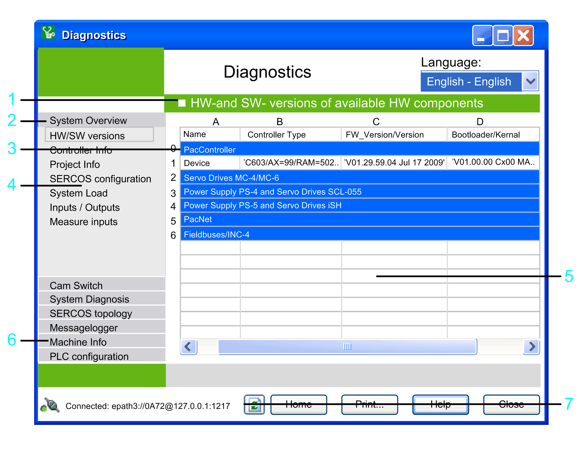

# Displaying Data

## Overview

In order to display controller data, click the button Show data... in the [**Home** window](D-SE-0041404.html#D-SE-0041404). The  HW- and SW-versions of available HW components  window allows you to display controller data in different ways.

**1** Title of the selected view.

**2** Selects a data view or a group (summary of data views).

**3** Selected view.

**4** Selects a view.

**5** You can sort the data in the table by clicking one of the column headings.

**6** Choose a data view using group and side buttons.

**7** Refresh button: Updates the data on the screen. **Note:** The message logger data is not updated during the data update. You can add it by executing the command **Load message logger** from the contextual menu of the **Message logger** view.

For more information on the individual elements, refer to the [*General Views* chapter](D-SE-0041412.html#D-SE-0041412).

EIO0000002005.05