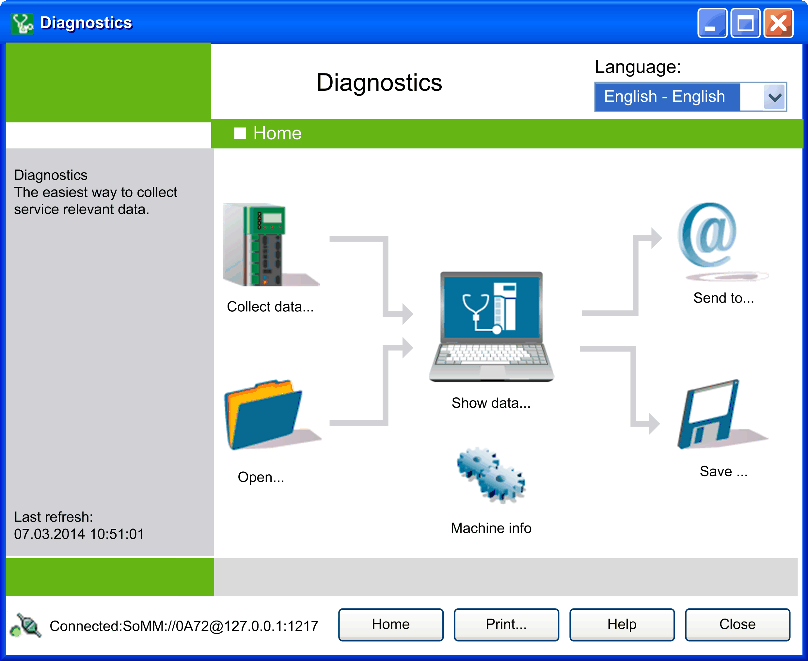

# Home Window

## Overview

For a general description of the main elements and the toolbar, refer to the [General Information chapter](D-SE-0041404.html#D-SE-0041404).

The table provides descriptions of the individual functions:

| Parameter | Description |
| --- | --- |
| Collect data ... | Opens the [**Connect to controller via...** window](D-SE-0042150.html#D-SE-0042150) from which data of the controller can be called. |
| Show data ... | Opens a [window](D-SE-0041410.html#D-SE-0041410), in which the data of the controller is displayed in a table according to subject. |
| Send to ... | Opens a [dialog box](D-SE-0041435.html#D-SE-0041435) that allows you to send the data to an e-mail address.  NOTE: An e-mail client program such as Microsoft Outlook must be installed on your PC. |
| Open ... | Opens a [dialog box](D-SE-0041427.html#D-SE-0041427) that allows you to load previously saved data from the file system. |
| Machine info | Opens a [dialog box](D-SE-0041429.html#D-SE-0041429) that allows you to save additional information about the controller, such as a special name or the name of the operator and a comment. |
| Save ... | Opens a [dialog box](D-SE-0041428.html#D-SE-0041428) that allows you to save the data in the file system. |
| Home | Goes to the Home window. |
| Print ... | Creates an html file of available documents and [displays them in the default browser](D-SE-0041431.html#D-SE-0041431). You can view, save, or print the html file with the browser functionalities. In this way, you can forward or archive your evaluations independent of Diagnostics for viewing purposes.  NOTE: Java Script must be active in your browser. |
| Help | Displays this online help. |
| Close | Ends Diagnostics. |

EIO0000002005.05