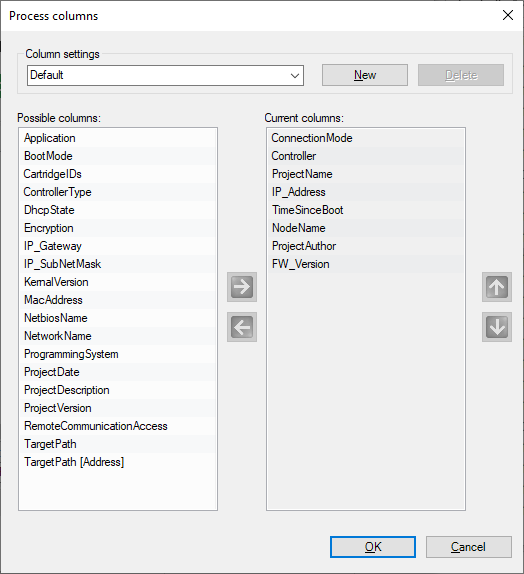

# Connecting to controller via... Network Device Identification

## Network Device Identification

The General  tab of the Connect to controller via... window allows you to select a device from a list of connected controllers.

The Network Device Identification service is used to automatically detect connected controllers. It shows a list of controllers available in the network.

Select the [connection mode](D-SE-0077990.html#D-SE-0077990).

Double-click a controller from the list or enter missing connection data if not listed. Then click Connect  to collect data from the given controller.

Network Device Identification function providing a list of controllers available in your network:

Carefully manage the IP addresses because each device on the network requires a unique address. Having multiple devices with the same IP address can cause unintended operation of your network and associated equipment.

This also applies to the NodeNames . Each device on the network requires a unique  NodeName.

| WARNING | |
| --- | --- |
|  | UNINTENDED EQUIPMENT OPERATION  * Verify that there is only one main controller configured on the network or remote link. * Verify that all devices have unique addresses. * Obtain your IP address from your system administrator. * Confirm that the IP address of the device is unique before placing the system into service. * Do not assign the same IP address to any other equipment on the network. * Update the IP address after cloning any application that includes Ethernet communications to a unique address.  Failure to follow these instructions can result in death, serious injury, or equipment damage. |

## Changing the Communication Settings Via Ethernet Using the Contextual Menu

To change the communication settings of a controller via the Ethernet connection, use the contextual menu. However, to this end the controller must already be visible in the network.

To change the communication settings of M258 and LMC058 controllers with specific firmware versions that do not support this feature, use the USB mass storage device.

To achieve this, right-click the entry of the controller in the Controller selection list and execute the command Process communication settings...  from the contextual menu.

## Description of the Buttons in the Toolbar

The following buttons are available in the toolbar:

| Button | Description |
| --- | --- |
| Optical | Click this button to cause the selected controller to indicate an optical signal: It flashes a control LED quickly. This can help you to identify the respective controller if many controllers are used.  The function stops on a second click or automatically after about 30 seconds.  NOTE: The optical signal is issued only by controllers that support this function. |
| Optical and acoustical | Click this button to cause the selected controller to indicate an optical and an acoustical signal: It starts to beep and flashes a control LED quickly. This can help you to identify the respective controller if many controllers are used.  The function stops on a second click or automatically after about 30 seconds.  NOTE: The optical and acoustical signals are issued only by controllers that support this function. |
| Update | Click this button to refresh the list of controllers. A request is sent to the controllers in the network. Any controller that responds to the request is listed with the present values.  Pre-existing entries of controllers are updated with every new request.  Controllers that are already in the list but that do not respond to a new request are not deleted. They are marked as inactive by a red cross being added to the controller icon.  The Update button corresponds to the Refresh list  command that is provided in the contextual menu if you right-click a controller in the list.  To refresh the information of a selected controller, the contextual menu provides the command  Refresh this controller. This command requests more detailed information from the selected controller.  NOTE: The Refresh this controller  command can also refresh the information of other controllers. |
| Remove inactive controllers from list. | Click this button to remove all controllers marked as inactive controllers simultaneously from the list.  NOTE: Controllers that do not respond to a network scan are marked as inactive in the list. This is indicated by a red cross being added to the controller icon. Because of network issues, a controller can be marked as inactive even if this is not the case. The contextual menu that opens if you right-click a controller in the list provides 2 other commands for removing controllers:   * The Remove selected controller from list command allows you to remove only the selected controller from the list. * The Remove all controllers from list  command allows you to remove all controllers simultaneously from the list. |
| New Favorite...  and Favorite 0 | You can use Favorites to adjust the selection of controllers to your personal requirements. This can help you to keep track of many controllers in the network.  A Favorite  describes a collection of controllers that are recognized by a unique identifier.  Click a favorite button (such as  Favorite 0) to select or deselect it. If you have not selected a favorite, all detected controllers are visible.  You can also access Favorites  via the contextual menu. It opens upon right-clicking a controller in the list.  Move the cursor over a favorite button in the toolbar to view the associated controllers as a tooltip. |

## List of Controllers

The list of controllers in the middle of the Controller selection view of the device editor lists those controllers that have sent a response to the network scan. It provides information on each controller in several columns. You can adapt the columns displayed in the list of controllers according to your individual requirements.

To achieve this, right-click the header of a column to open the Process columns dialog box.

You can create your own layout of this table. Click  New, and enter a name for your layout. Shift columns from the list of Possible columns to the list of  Current columns and vice versa by clicking the horizontal arrow buttons. To change the order of the columns in the Current columns  list, click the arrow up and arrow down buttons.

## Managing Favorites

To manage favorites in the list of controllers, proceed as follows:

| Step | Action |
| --- | --- |
| 1 | Select the controller in the list of controllers. |
| 2 | Right-click the controller and select one of the commands:   * New Favorite to create a new group of favorites. * Favorite n in order to    + Add the selected controller to this list of favorites.   + Remove the selected controller from this list of favorites.   + Remove all controllers from this list of favorites.   + Select a favorite.   + Rename a favorite.   + Remove a favorite. |

## Continue Reading / Writing Data

After you have selected a controller, click the button on the right-hand side to continue the writing/reading process.

## Cancel Operation

To cancel the operation, click the Home  button. The Home  window opens.

EIO0000002005.05