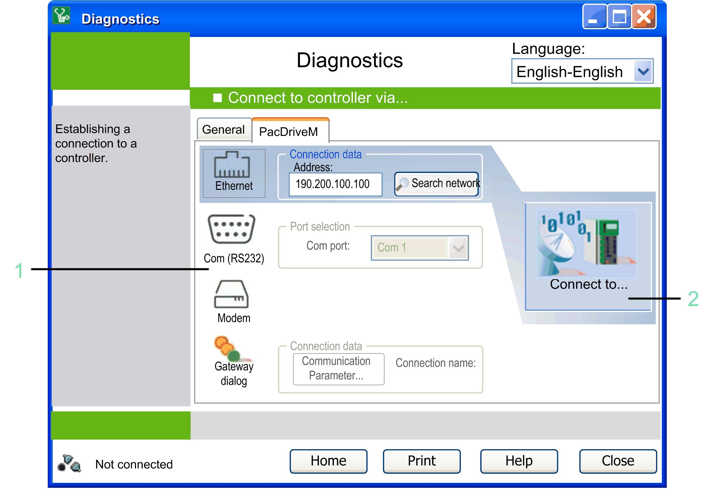

# Connecting to PacDrive M Controllers

## Overview

The  PacDriveM tab of the  Connect to controller via... window allows you to connect to a PacDrive M controller. This chapter describes the specific settings for PacDrive M controllers.

## Description of the Elements

**1** Select the type of connection: Choose the type of connection you wish to use to connect to the controller.

**2** Collect data: The connection to the controller is established and the data is downloaded.

## Collecting Data

After you have selected the connection type, the connection to the controller is established and the data is collected. The status is displayed in the [connection status line](D-SE-0041404.html#D-SE-0041404__D-SE-0041404.2). After the data collection has been successfully completed, the  Home window opens again. If errors are detected during the data collection, they are indicated in the [**Communication Log** view](D-SE-0041416.html#D-SE-0041416).

## Ethernet Communications

Select the option Ethernet  in order to communicate with PacDrive M controllers. It is the fastest method to read and write data.

NOTE: For the other transfer methods, long waiting periods during the transfer are to be expected when exchanging large volumes of data.

Ethernet communication uses the TCP/IP protocol. To establish a communication, a valid IP address of the controller is required. You can enter it directly in the text box  Address. To execute a search for the controllers available in the network, click the button  Search network. This dialog box starts the Network Device Identification function. It is also available in the General [tab](D-SE-0042150.html#D-SE-0042150). Select a controller from the list and click the Apply  button to add the marked controller to the controller selection list of the General  [tab](D-SE-0042150.html#D-SE-0042150).

## Serial Communications

If the controller is connected to the PC via serial cable, select the option Com (RS232). Select the Com Port where the controller is connected, and click the  Reading or Writing button.

## Communication Via Modem

Before you can communicate with the PacDrive M controller via modem, configure the modem connection on the PC using the Windows modem features. For further information on this topic, refer to the Windows online help.

After the connection via modem has been configured, you can select the option  Modem, and click the  Reading or Writing button.

## Communication Via Gateway

To establish a communication to the controller via gateway, set the Communication parameters  and define a Connection name , and click the Reading  or Writing  button.

## Changing the Communication Settings of a PacDrive M Controller Via Serial Data Transfer

If the PacDrive M controller is connected to the PC via a serial cable, click the button  Transfer communication settings serial to a controller... . The Transfer communication settings serial dialog box opens. It allows you to enter the IP address , the Subnet mask , and the Gateway  you want to assign to the PacDrive M controller. Select the Com port  where the PacDrive M controller is connected, and click OK to transfer the settings to the PacDrive M controller.

After successful transfer of the communication settings, you can transmit the data of the PacDrive M controller via the fast Ethernet connection. The communication settings can also be modified via the contextual menu. However, to this end the PacDrive M controller must already be visible in the network (from firmware version >= V00.15.00).

EIO0000002005.05